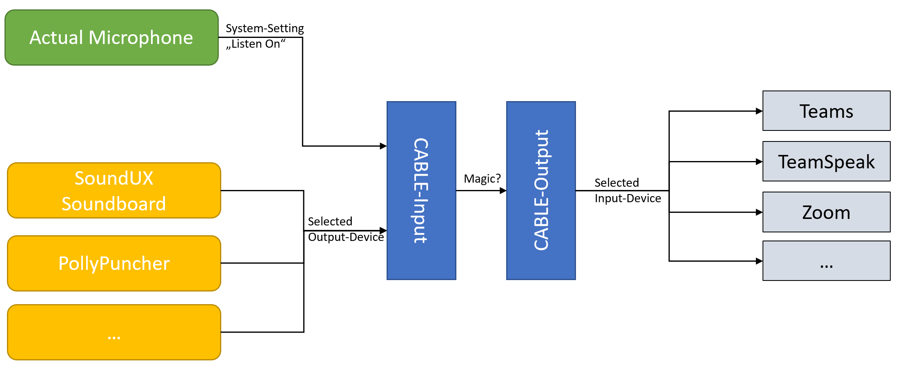

# Polly Puncher

Hi ! Welcome to this little pet project.

PollyPuncher is a small Windows App that lets you contact the [AWS Polly API](https://aws.amazon.com/polly/?nc1=h_ls) to play or save Text-To-Speech. 

I intent to use this mostly for memes and jokes, and I encourage you to do so too. 
This is not meant to be an industrial TTS-tool for audiobooks or accessability or anything, 
just to :hankey:-post in calls. 

**Important: You will need your own AWS Key!**

## Intended use

I installed [VB-Audio-Cable](https://vb-audio.com/Cable/) on my machine which gives me two virtual audio devices: CABLE-Input & CABLE-Output. 
In any program you can set the Audio-Output to CABLE-Input which will then be played to CABLE-output. 
The CABLE-output can be used instead of a microphone to play e.g. the TTS. 

For my setup I also adjusted the system settings so that my actual microphone *playback* to the CABLE-Input, you can find a [tutorial here](https://helpdeskgeek.com/how-to/record-sound-using-line-in-microphone-windows/).

And that's it! You can cheer up all your friends on any conference software you might use. 
They can basically not escape your good vibes!

## Known Limitations 

**Region Locked** - The AWS Region is hardcoded to EUCentral1, I am not sure if that means that your Key doesn't work if its not in EU. 

**No Neural Voices** - Just the [AWS Standard-Voices](https://docs.aws.amazon.com/polly/latest/dg/voicelist.html) are supported.

**AWS Keyfile must be CSV** - There is currently no support to pass your tokens/id/key without using the `.csv`-file. 
You  can follow [the guides from amazon](https://docs.aws.amazon.com/AWSEC2/latest/UserGuide/security-iam.html). *Note:* The created file is not actually a valid `.csv`-file, but why would amazon care? 

## Note 

The preview is (mostly) a recolor of the OpenMoji Parrot. 
